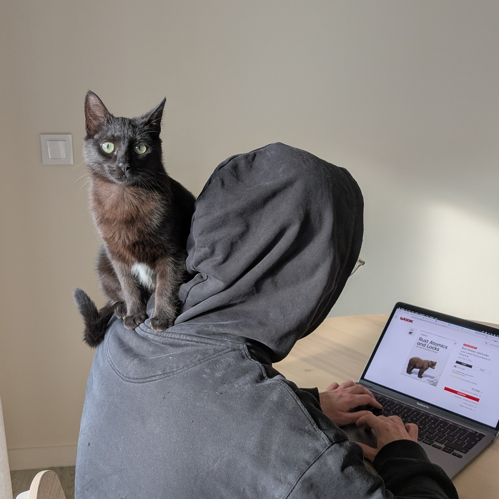
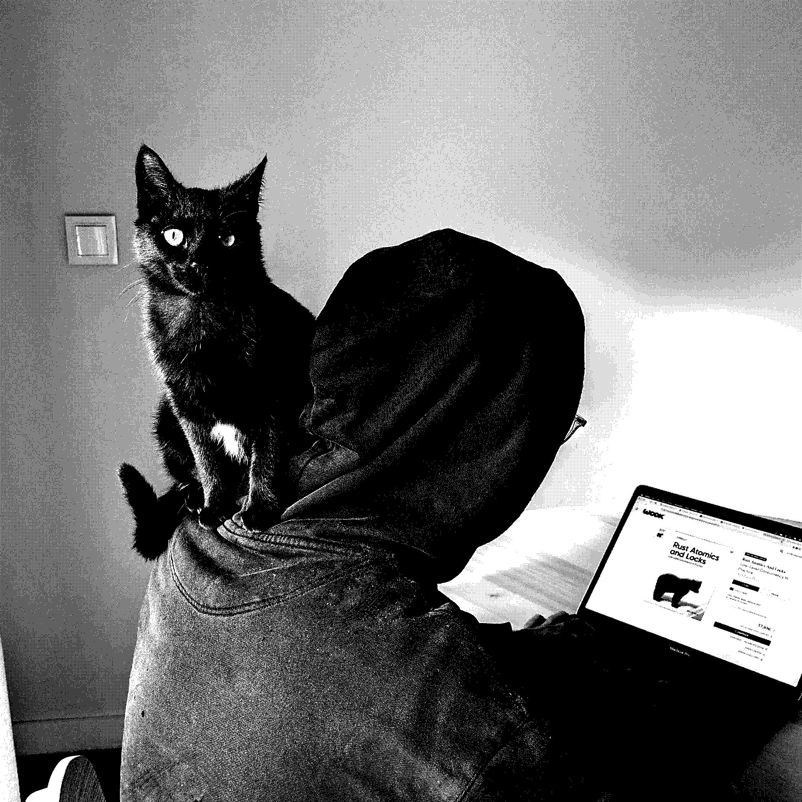

# dither

Pillow, numpy & numba based implementation of [ordered dithering](https://en.wikipedia.org/wiki/Ordered_dithering).

<div style="display: flex">


</div>

A completely unscientific benchmark, running dithering on a `2262x2262` image on a MacBook Pro 2022 - Apple M2:
```
jose.duarte@Mac ~/D/dither (main)> time uv run python dither.py

________________________________________________________
Executed in  324.44 millis    fish           external
   usr time  268.74 millis    0.25 millis  268.50 millis
   sys time   48.69 millis    1.19 millis   47.49 millis
```

Note — the algorithm seems to be ok, but the script struggles with some images,
I'm not entirely sure why, but cropping in MacOS seems to re-write the image in such a way that it starts working.

## Setup

This project uses [uv](https://github.com/astral-sh/uv) for fast Python package management.

1. **Install dependencies**:

   ```sh
   uv pip install -r <(uv pip compile pyproject.toml)
   ```

2. **Run the main script**:

   ```sh
   uv run python dither.py
   ```

